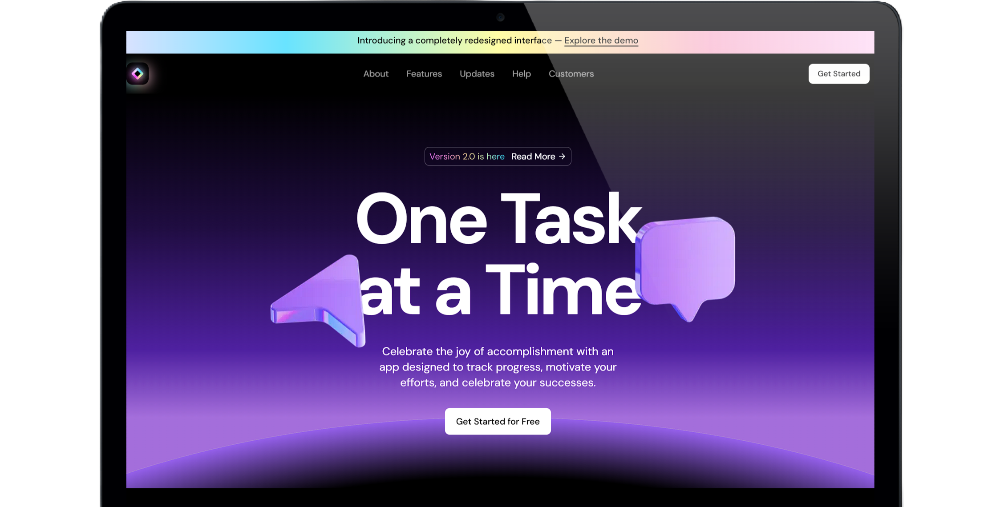

# 🚀 SaaS Landing Page

ㅤ


## 🎯 Overview
Welcome to the **SaaS Landing Page**, a beautifully crafted, highly responsive landing page built using modern tools and libraries. Perfect for showcasing products, services, or ideas!

## 🛠️ Built With
Here's a breakdown of the tech stack that powers this project:

### 🖼️ Radix UI
- `@radix-ui/react-accordion`: Interactive accordion components
- `@radix-ui/react-icons`: A collection of elegant icons
- `@radix-ui/react-separator` & `@radix-ui/react-slot`: Layout and design helpers

### 🎨 Styling
- `tailwindcss-animate`: Beautiful animations with Tailwind CSS
- `tailwind-merge`: Dynamic merging of Tailwind CSS classes
- `class-variance-authority`: Manage CSS classes with ease

### 🎥 Animations
- `framer-motion`: Seamless animations for an interactive user experience

### 🧩 React Ecosystem
- `react` & `react-dom`: The backbone of the app!
- `lucide-react`: A sleek set of SVG icons

### 🌐 Framework
- `next`: The powerful React-based framework for building the web

## ✨ Key Features
- **Responsive Design** 🌟: Looks great on all devices
- **Seamless Animations** 🌀: Add life to every interaction
- **Optimized Performance** ⚡: Built for speed and efficiency


## 🚀 Get Started

### 1️⃣ Clone the Repository
```bash
git clone https://github.com/vipulkatwal/mind-matrix-landing-page.git
cd mind-matrix-landing-page
```

### 2️⃣ Install Dependencies
```bash
npm install
```

### 3️⃣ Start the Development Server
```bash
npm run dev
```

Open your browser and navigate to `http://localhost:3000`.

## 🖼️ Future Improvements
- 🌈 Add light and dark themes
- 🌐 Support for multiple languages
- 🛒 Integration with e-commerce solutions

> This project includes elements adapted from "SaaS Website UI Kit" by Framer. Retrieved from [Source Link](https://www.figma.com/community/file/1347551304372055519).

## 🌐 Live Demo
[SaaS Landing Page](https://mind-matrix-landing-page.vercel.app)


## 📬 Feedback
Got ideas or suggestions? We'd love to hear from you!

Reach out at: 📧 **vipulkatwal@example.com**

## 💻 License
This project is licensed under the **MIT License**. Feel free to use and share!

Enjoyed this project? Don't forget to give it a ⭐ on GitHub!

## 🎉 Thank you for checking out the SaaS Landing Page!